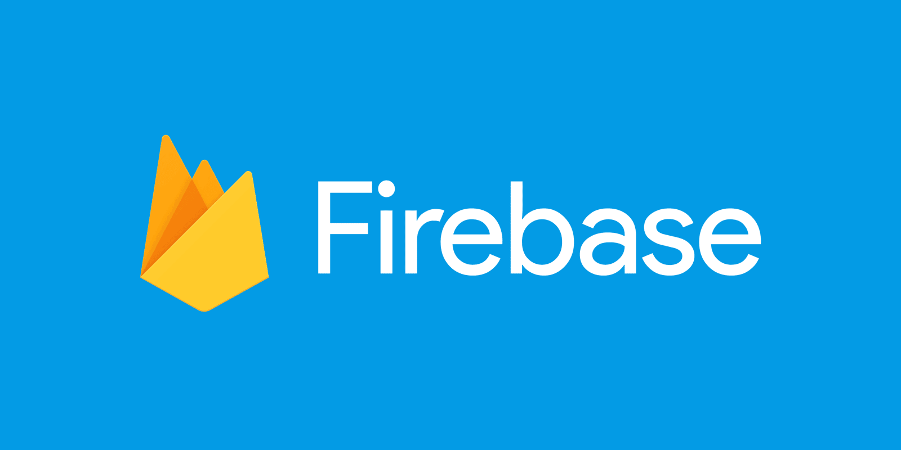

### Tecnologias que Uso Diariamente

Aqui estão algumas das principais tecnologias com as quais trabalho todos os dias. Cada uma delas desempenha um papel fundamental em meus projetos de desenvolvimento de software.

| Tecnologia | Descrição | Link |
|:----------:|-----------|------|
|  | **Android Studio** é a IDE oficial para desenvolvimento de aplicativos Android. Utilizo para criar e testar aplicativos móveis. | [Mais sobre Android Studio](https://developer.android.com/studio) |
|  | Estas são as tecnologias básicas para desenvolvimento web. Utilizo **HTML5**, **CSS3**, e **JavaScript** para criar interfaces de usuário dinâmicas. | [Mais sobre HTML5](https://developer.mozilla.org/en-US/docs/Web/Guide/HTML/HTML5) [Mais sobre CSS3](https://developer.mozilla.org/en-US/docs/Web/CSS/CSS3) [Mais sobre JavaScript](https://developer.mozilla.org/en-US/docs/Web/JavaScript) |
|  | **Node.js** é uma plataforma de desenvolvimento no lado do servidor baseada em JavaScript, ideal para construir aplicações escaláveis. | [Mais sobre Node.js](https://nodejs.org/en/about/) |
|  | **Vue.js** é um framework progressivo para construir interfaces de usuário. | [Mais sobre Vue.js](https://vuejs.org) |
|  | **Firebase** fornece uma suite de ferramentas para desenvolver aplicativos de alta qualidade rapidamente, incluindo funcionalidades como banco de dados, autenticação, e hospedagem. | [Mais sobre Firebase](https://firebase.google.com) |
|  | **MongoDB** é um sistema de banco de dados NoSQL orientado a documentos, que uso para gerenciar grandes conjuntos de dados com estruturas flexíveis. | [Mais sobre MongoDB](https://www.mongodb.com) |
|  | Tenho conhecimento em administração de **Servidores Virtuais Privados (VPS)**, gerenciando e configurando ambientes de servidor para desempenho e segurança otimizados. | [Mais sobre VPS](https://www.digitalocean.com/community/tutorials/a-comprehensive-introduction-to-managing-your-servers) |

